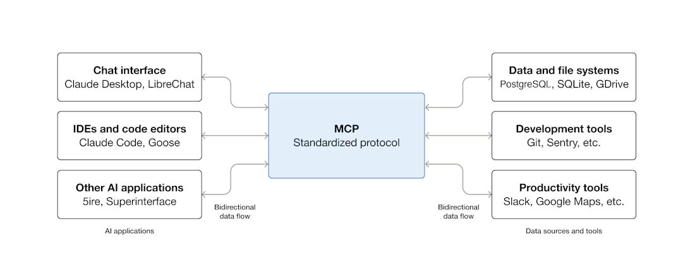

# Model Context Protocol (MCP) Servers

## Overview: USB-C for AI

Think of MCP as **USB-C for AI** - a universal standard that allows AI applications to connect to any data source or tool through a single, standardized interface.

Just as USB-C replaced the chaos of multiple proprietary connectors (mini-USB, micro-USB, Lightning, etc.), MCP replaces the need for custom integrations between AI models and external systems. Instead of building separate connectors for each database, API, or tool, you can use MCP servers that "just work" with any MCP-compatible AI application.

## Key Concepts

### MCP Servers

MCP servers expose **three core primitives** to AI applications:

1. **Resources** - Data and content that can be read by the AI
   - Files, database records, API responses, live data feeds
   - Think: "What can the AI read?"

2. **Prompts** - Pre-built prompt templates and workflows
   - Reusable instructions, conversation starters, agentic workflows
   - Think: "What can guide the AI's behavior?"

3. **Tools** - Functions the AI can execute
   - Database queries, API calls, file operations, computations
   - Think: "What actions can the AI take?"

### Architecture

```
┌─────────────────┐
│   AI Client     │  (VS Code, Claude Desktop, etc.)
│  (MCP Client)   │
└────────┬────────┘
         │ MCP Protocol
         ├─────────────┬─────────────┬─────────────┐
         │             │             │             │
    ┌────▼────┐   ┌───▼────┐   ┌───▼────┐   ┌───▼────┐
    │Database │   │GitHub  │   │Slack   │   │Browser │
    │  MCP    │   │  MCP   │   │  MCP   │   │  MCP   │
    │ Server  │   │ Server │   │ Server │   │ Server │
    └─────────┘   └────────┘   └────────┘   └────────┘
```

### Benefits

- **Standardization** - One protocol to connect everything
- **Reusability** - Build once, use across any MCP-compatible AI app
- **Separation of Concerns** - Data sources remain independent
- **Ecosystem** - Growing marketplace of pre-built MCP servers

### Example Use Cases

- **Database Access** - AI can query Postgres, MongoDB, or Cosmos DB through their respective MCP servers
- **API Integration** - Connect to GitHub, Slack, Jira, or any REST API
- **File Systems** - Read/write files, search codebases, manage documents
- **Browser Automation** - Interact with web applications programmatically

## Diagram

[MCP Architecture Overview](https://modelcontextprotocol.io/introduction#architecture)


## Learn More

- Official Specification: https://spec.modelcontextprotocol.io/
- MCP Documentation: https://modelcontextprotocol.io/
- GitHub Repository: https://github.com/modelcontextprotocol
