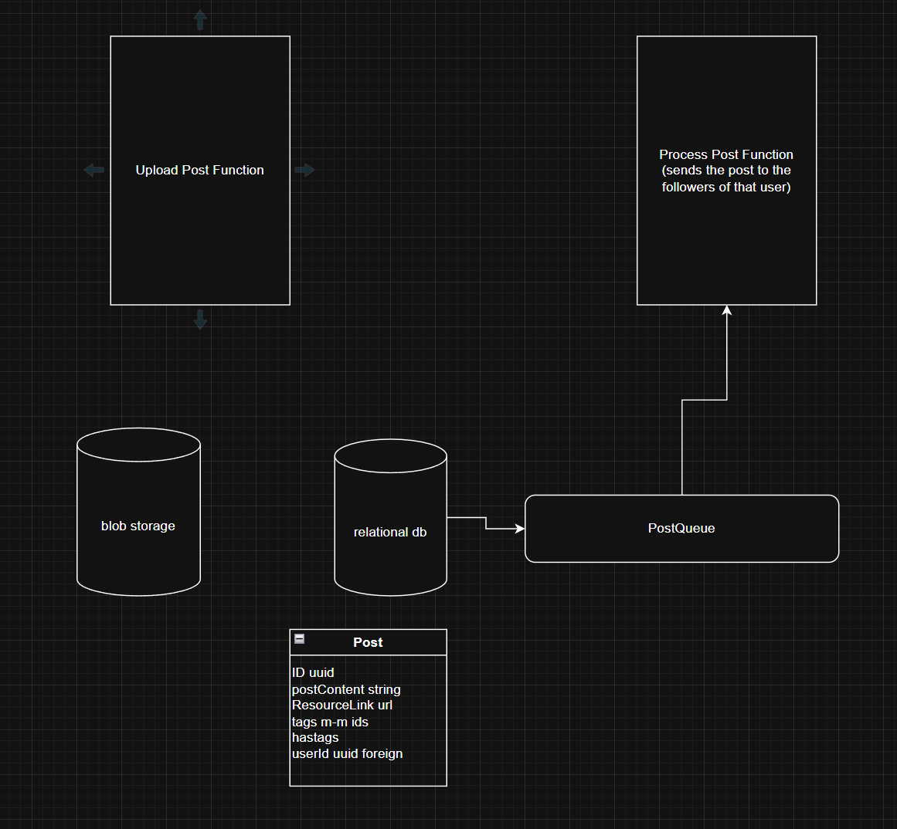

# Twitter System Design

## Functional Requirements

From a user perspective

1. View posts in a feed (a mix of algorithmic recs, from followed)
   (posts are text, with optional image)
2. Like, comment, retweet, save / favorite it
3. Upload a post
4. Search trending by topic (#'s) or just generally
5. follow people

## Development Requirements

- Highly available application
- be able to handle millions of users both uploading posts and viewing their feed
- in seconds be able to notify all followers about a users new post

## API Endpoints

- Upload post endpoint
- Get page of posts for feed endpoint (by user)
- Get page of posts for trending endpoint
- Follow / unfollow user

## Implementation

Upload Post Endpoint:
Post content:
max of 500 characters for text
tag users
do hashtags to bucket the content
max of one image in post or one 15 second video
per user, max of 1000 posts a day

## Initial Passthrough

