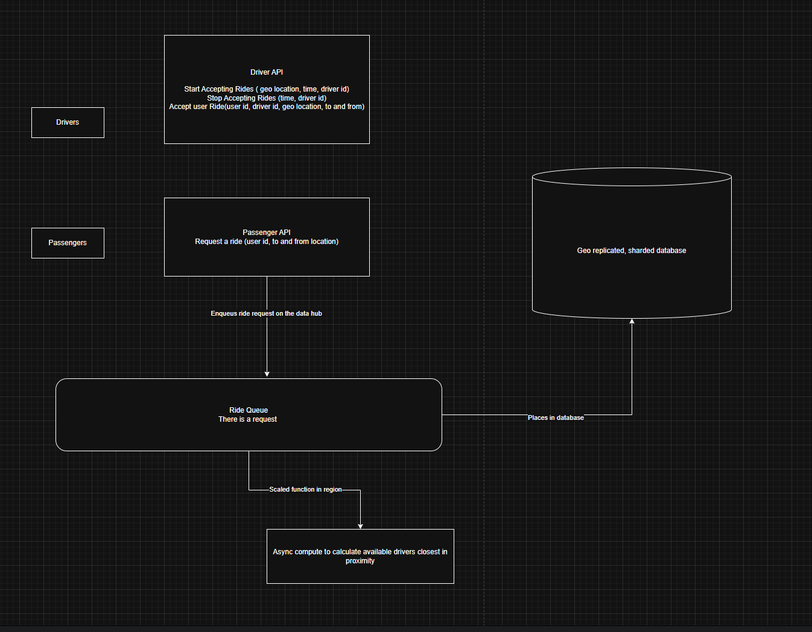

# Uber System Design

## Functional Requirements

Driver Experience

- Enable taxi mode (start to accept rides in the area)
- disable taxi mode
- accept a passeger

Passenger Experience

- Request a ride
- Cancel a ride
- Pay
- During trip view directions
- Rate the driver after trip

## Non Functional Requirements

Highly available app
Write heavy system (constantly geo location is updating)
30 million rides a day

## Api Diagram

